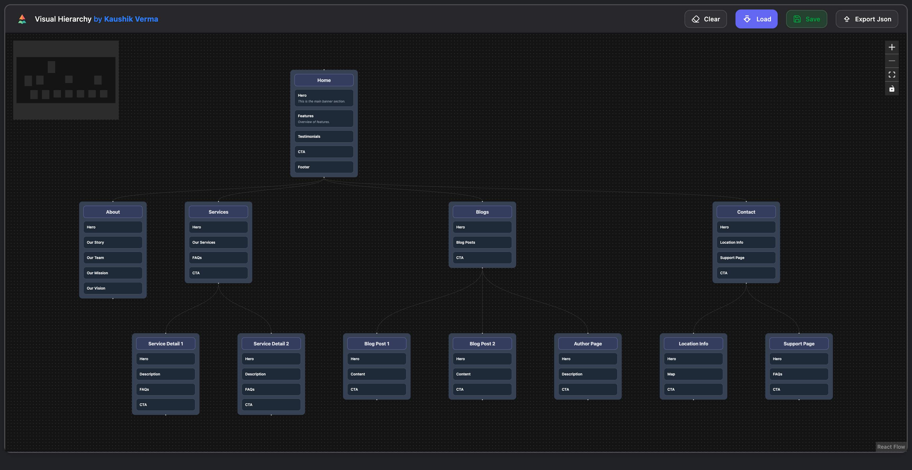

# Visual Hierarchy – Website Flow Builder

<div align="center">
  

  <h3>Map, design, and refine your website structure with visual clarity</h3>

<a href="https://react.dev/"></a>
<a href="https://vitejs.dev/"></a>
<a href="https://tailwindcss.com/"></a>
<a href="https://xyflow.com/"></a>

</div>

## 🚀 Overview

**Visual Hierarchy** is an interactive tool for planning and visualizing website architecture. Each page becomes a node in a flow, with draggable sections that represent key content blocks (Hero, Features, Pricing, CTA, etc.). This makes it easy to explore different layouts, user journeys, and information hierarchies before you ever touch production code.

### ✨ Key Features

- **🧭 Visual site mapping** – Represent pages and user journeys as a connected node graph.
- **📦 Structured page sections** – Define, reorder, and refine sections within each page node.
- **🖱️ Drag-and-drop editing** – Intuitive DnD for rearranging sections and managing the flow.
- **💾 Save & restore flows** – Persist your flows to `localStorage` to revisit later.
- **📤 Import / export JSON** – Export the entire flow as JSON and import it back when needed.
- **🌙 Modern dark UI** – Clean, focused interface built with TailwindCSS and Radix-inspired patterns.

## � Screenshot

<div align="center">
  
</div>

## �🛠️ Technology Stack

- **Framework:** React 19 + Vite 7
- **Routing:** React Router 7
- **Diagramming:** `@xyflow/react` (React Flow)
- **Drag & Drop:** `@dnd-kit` (core, sortable, utilities)
- **Styling & UI:** TailwindCSS 4, custom components, Lucide icons
- **Tooling:** ESLint 9, Prettier 3

## 🚀 Quick Start

### Prerequisites

- Node.js **18+**
- npm (or another compatible package manager)

### 1. Clone the repository

```bash
git clone https://github.com/your-username/visual-hierarchy.git
cd visual-hierarchy
```

### 2. Install dependencies

```bash
npm install
```

### 3. Start the development server

```bash
npm run dev
```

Open your browser and navigate to the URL shown in the terminal (typically `http://localhost:5173`).

### 4. Build for production

```bash
npm run build
npm run preview
```

This creates an optimized production build and serves it locally for inspection.

## 📁 Project Structure

```bash
visual-hierarchy/
├── public/
│   └── hierarchy.ico            # Favicon / base assets
├── src/
│   ├── components/
│   │   ├── flow.jsx             # React Flow canvas + logic
│   │   ├── customNode.jsx       # Custom node layout & sections
│   │   ├── sidebar.jsx          # Sidebar editor for nodes/sections
│   │   ├── header.jsx           # Top bar (actions, branding)
│   │   ├── main.jsx             # Root page wrapper
│   │   ├── sortableList.jsx     # Reorderable list abstraction
│   │   ├── sortableItem.jsx     # Sortable list item
│   │   └── ui/                  # Reusable UI primitives
│   │       ├── button.jsx
│   │       ├── dialog.jsx
│   │       ├── dropdown-menu.jsx
│   │       ├── input.jsx
│   │       ├── label.jsx
│   │       └── sheet.jsx
│   ├── hooks/
│   │   └── use-mobile.js        # Mobile viewport helpers
│   ├── lib/
│   │   └── utils.js             # Shared utilities
│   ├── App.jsx                  # App shell & routing
│   ├── App.css                  # App-level styles
│   ├── main.jsx                 # React entry point
│   └── index.css                # Global styles / Tailwind
├── initialNodes.json            # Seed nodes for the initial flow
├── initialEdges.json            # Seed edges for the initial flow
├── package.json                 # Scripts & dependencies
├── vite.config.js               # Vite configuration
└── eslint.config.js             # ESLint configuration
```

## 💡 How It Works (High Level)

- **React Flow** powers the canvas, nodes, and edges, handling zooming, panning, and viewport state.
- **Custom nodes** render page titles and their sections, with drag-and-drop to reorder sections.
- **Sidebar controls** let you edit node titles, add/remove sections, and tweak your structure.
- **Persistence** is handled via `localStorage`, and flows can be exported/imported as JSON files.

## 📜 License

This project is currently for personal/experimental use. Add a license here if you plan to open source or distribute it.

## 👨‍💻 Author

**Kaushik Verma**  
[LinkedIn](https://www.linkedin.com/in/itskaushikverma) | [Portfolio](https://www.kaushikverma.com) | [GitHub](https://github.com/itskaushikverma) | [Twitter](undefined)
